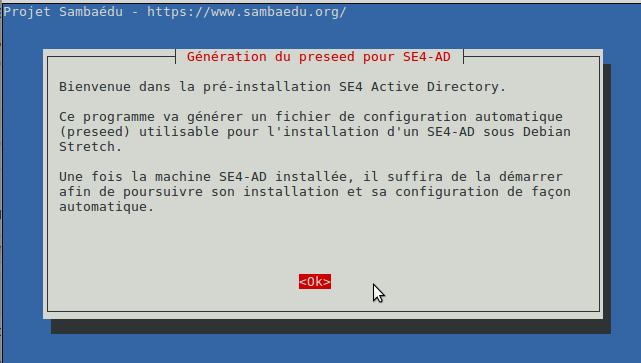
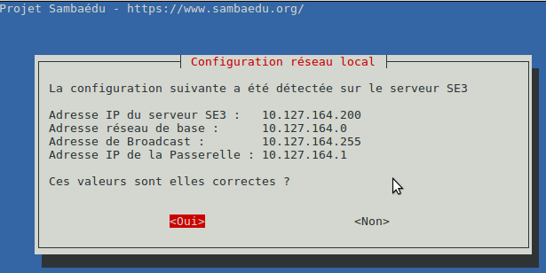
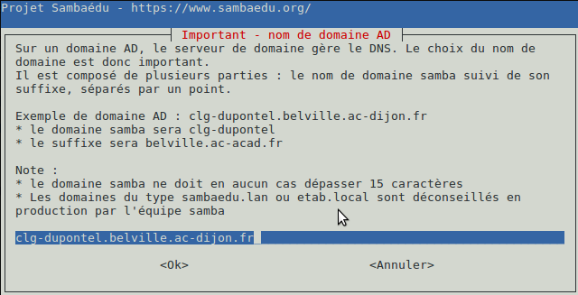
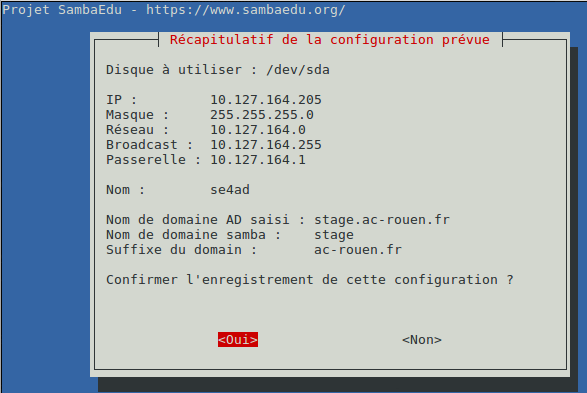
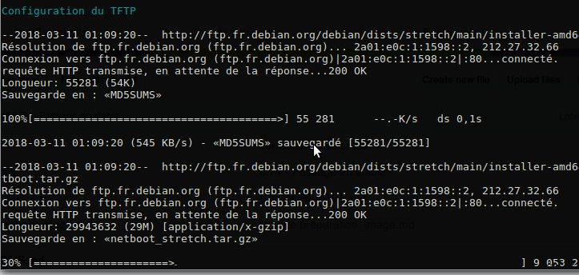
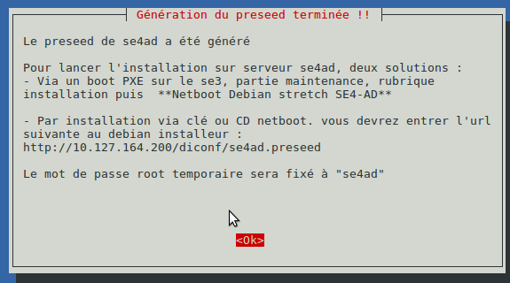

=========================================================================
Génération d'un preseed et installation automatique d'un serveur SE4-AD 
=========================================================================

.. sectnum::
.. contents:: Table des matières

Introduction
============
Ce document a pour but de décrire précisément la procédure d'installation automatique d'un serveur SE4 Active Directory en utilisant un preseed généré au préalable sur le serveur se3 contenant les données d'origine. L’installation se déroule en trois temps:

* Lancement du script permettant de générer le preseed à partir des réponses fournies 
* Installation du serveur avec le preseed et pré-configuration de ce dernier 
* La finalisation de la configuration du serveur sous debian Stretch avec réintégration des données précédentes et peuplement de l'AD 

Cette documentation s’attardera plus précisément sur les deux premières parties. La finalisation étant détaillée dans une autre documentation_ car elle n'est pas propre au type d'installation évoqué ici à savoir un serveur autonome ou virtualisé mais s'applique également aux containers LXC.
 

.. _documentation: install-se4AD.rst

Déroulement du script générant le preseed
=========================================

A partir du moment où le paquet ``sambaedu-config`` est installé, le script se trouve dans le dossier /usr/share/se3/sbin.

La commande à lancer est donc la suivante :

.. Code::

 /usr/share/se3/sbin/gen_preseed_se4ad.sh
 
 

Accueil
-------

Après le message de bienvenue, un court résumé des paramètres réseau actuel détectés est affiché. 

Ces valeurs serviront de base pour la configuration réseau du serveur AD. Si elles ne sont pas correctes, il suffit de répondre ``non``. Dans ce cas il sera possible de préciser les bonnes valeurs une par une à l'aide de boites de dialogue.

Paramétrage réseau du futur SE4-AD
----------------------------------

Viennent ensuite quelques questions sur la configuration réseau.

Choix d'une IP et d'un nom
..........................

On commence par saisir l'IP du serveur se4-AD. S'il est dans le même subnet que l'actuel serveur Se3, il suffit de compléter le début de l'IP suggérée. 

.. Attention :: Il faut bien saisir avec une adresse indépendante, donc pas la même IP que le Se3.

.. figure:: images/gen_preseed3.png

De même on donne un nom au serveur AD. Le choix par défaut semble correct :).  

.. figure:: images/gen_preseed4.png

Choix du nom de domaine
.......................

.. Attention :: Un point tout particulier est à apporter au domaine AD. En mode active directory il correspond au domaine DNS sur lequel Le serveur AD sera serveur de nom. Par défaut le nom de domaine AD proposé sera le domaine DNS actuel du Se3. Vous pouvez utiliser ce choix ou le modifier à votre convenance. Le fait que toutes les machines clientes seront sur cette même zone DNS distribuée par le DHCP est également à prendre en compte. Il faut donc bien réfléchir à ce choix si l'on veut obtenir quelque chose de cohérent au final.

Ce nom de domaine devra être composé d'au moins deux parties séparées par un point. Dans notre exemple, il y en a trois.
 
* La première partie correspond au domaine samba. Appelé également workgroup, cet élément ne **ne doit pas absolument pas dépasser 15 caractères**. A noter également qu'il n'est pas souhaitable de reprendre celui de Se3, à savoir l'habituel "sambaedu3" afin d'éviter tout conflit.

* La ou les parties suivantes correspondent à ce que l'on nomme le suffixe DNS

Résumé des paramètres avant génération du preseed
.................................................

Un récapitulatif de l'ensemble des paramètres saisis précédemment est affiché

Si tout parait correct, on peut confirmer. Dans le cas contraire, il sera proposé de corriger chaque paramètre.

Génération du preseed et configuration du TFTP
----------------------------------------------

A partir des éléments saisis précédemment, le script va déposer le preseed ainsi que les fichiers de configuration nécessaires à l'installation dans le dossier ``/var/www/diconf`` les rendant ainsi disponibles sur le serveur web du se3. Le TFTP du se3 est également configuré de sorte de pouvoir être utilisé pour cette installation. 

Tous les fichiers sont en place pour démarrer l'installation automatique de notre se4-AD

Vous pouvez effectuer l'installation de deux façons : 

* En utilisant le TFTP du Se3 en bootant en PXE et en choisissant l'option adéquate, détaillée plus loin dans ce document.
* En utilisant le preseed généré et son propre support d'installation debian Stretch sur CD ou clé USB.

Installation du serveur en utilisant le preseed généré
======================================================

Il s'agit maintenant d'utiliser le preseed généré précédemment.

Il faut commencer par démarrer le futur serveur se4AD, soit par un boot PXE, soit sur son support CD ou clé USB. Seul ce boot initial va différer, la suite sera commune puisque l'on chargera le même preseed.

Dans le cas d'un cd, il faudra donner l'url du preseed ::
 auto url=http://ip-du-serveur-se3/diconf/se4ad.preseed
 
Cas de l'installation en utilisant le boot PXE
----------------------------------------------

On effectue un boot PXE, on choisit ``Maintenance`` 

.. figure:: images/se4_preseed_boot1.png

puis ``Installation`` et enfin ``Netboot Debian Stretch SE4-AD (amd64)``. Seule l'architecture AMD64 est supportée.

.. figure:: images/se4_preseed_boot2.png

Déroulement de la suite de l'installation
------------------------------------------

Quelque soit la méthode employée (PXE / CD /Clé USB), une fois le preseed chargé la suite est automatique, à commencer par le partitionnement. 

Partitionnement
................

.. Attention :: Lors de cette étape toutes les données du disque sont effacées sans avertissement. 

Les partitions suivantes sont créés. Selon la taille du disque disponible, l'outil de partitionnement va moduler les tailles des partitions selon l'espace disque tout en respectant les règles suivantes :

* Partition Racine d'un minimum de 5Go, 10Go de préférence voire 20Go s'il reste de la place.
* Partition /var , 10Go de préférence et plus s'il reste de la place disponible, 
* Partition Swap de 16Go ou 200% de la ram au minimum

Installation du système
.......................

On commence par l'installation du système de base.

.. figure:: images/se4_preseed_base.png

La suite consiste à installer les logiciels complémentaires. Cela prend quelques minutes et fluctue selon le débit de votre connexion internet.

.. figure:: images/se4_preseed_softs.png

Configuration de Grub
.....................

Grub est installé afin de rendre le système bootable

.. figure:: images/se4_preseed_grub.png

Fin de l'installation
--------------------- 

Vient enfin le message final, signalant que le serveur est prêt à rebooter.

.. figure:: images/se4_preseed_final.png

A cette étape, vous disposez d'une debian stretch installé contenant tous les anciens fichiers de configuration de l'ancien annuaire. Il vous reste à lancer cette machine  et finaliser sa configuration. Pour cela, on se reportera à cette documentation_ détaillant les étapes nécessaires afin à l'obtention de votre SE4AD pleinement fonctionnel.

.. _documentation: install-se4AD.rst

