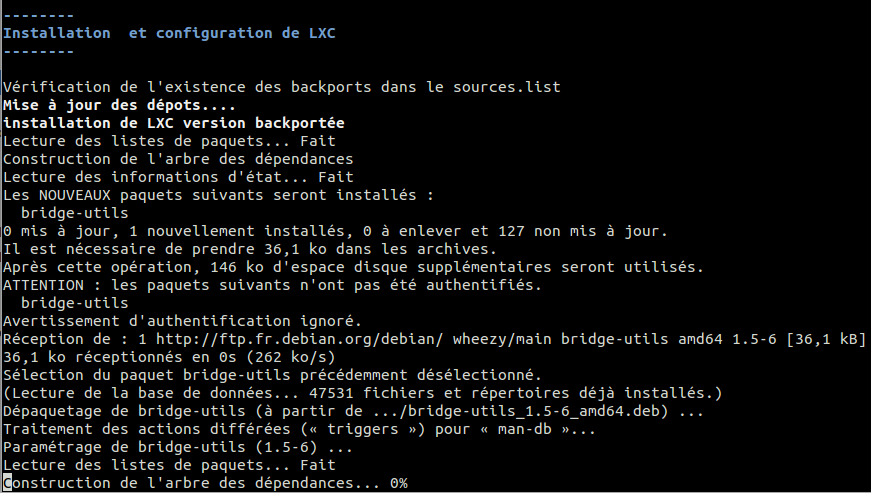
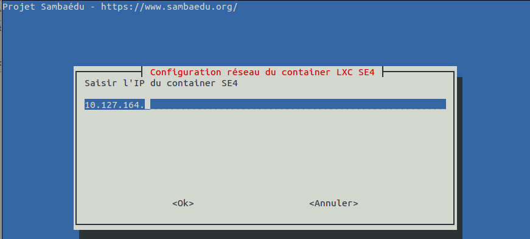
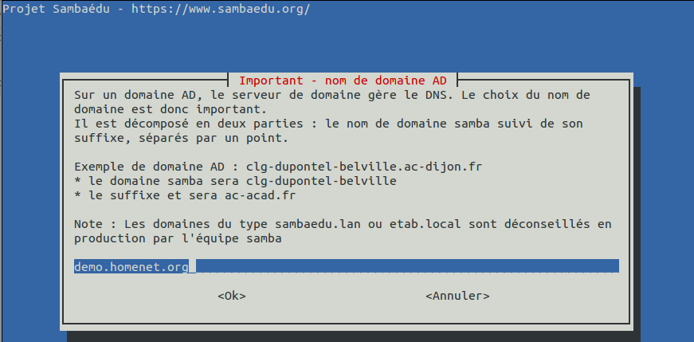
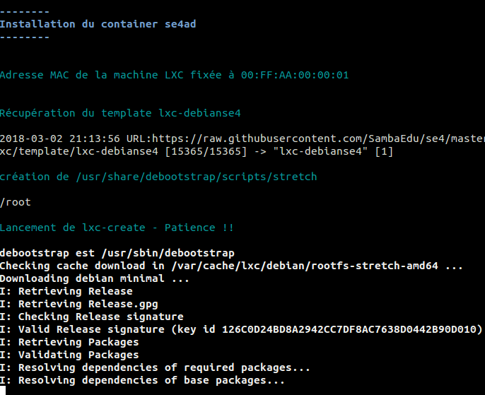
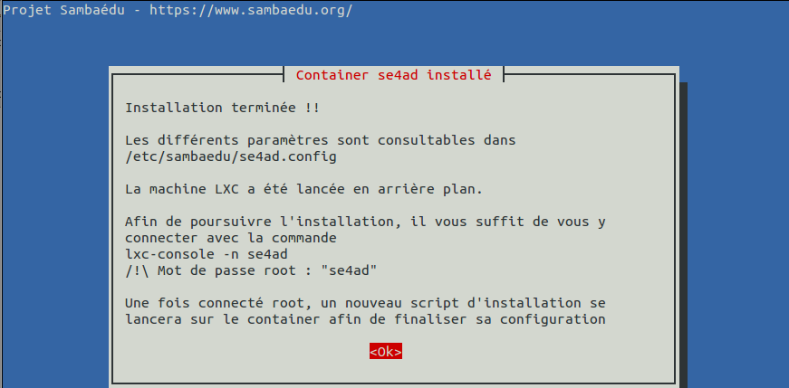
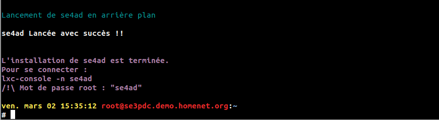
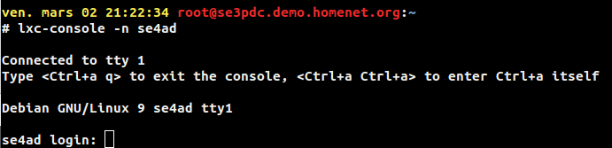

===================================================================================================
Procédure d'installation automatique d'un container LXC SE4-AD 
===================================================================================================

.. sectnum::
.. contents:: Table des matières

Introduction
============
Ce document a pour but de décrire précisément la procédure d'installation automatique d'un container LXC hébergeant SE4 Active Directory. L’installation se déroule en deux temps :

* Installation du container avec export des données importantes de la machine SE3, à savoir tout ce qui concerne l'annuaire et samba
* La finalisation de la configuration du container avec réintégration des données précédentes et peuplement de l'AD 

Ce documentation s’attardera plus précisément sur la première partie. La seconde partie est traitée à part dans une autre documentation_ car elle n'est pas propre à l'utilisation de LXC.
 

.. _documentation: install-se4AD.rst

Se procurer le script d'installation 
====================================
Le script d'installation se trouve sur l'espace Github du projet. Pour le récupérer, exécuter la commande suivante : ::

 wget https://raw.githubusercontent.com/SambaEdu/se4/master/sources/sambaedu-config/lxc/scripts/install_se4lxc.sh
  

Le script sera packagé dans le paquet ``sambaedu-config`` sous peu et ainsi disponible directement sur un serveur se3 installant ce paquet avec la méthode habituelle.

Déroulement de l'installation
=============================
Une fois le script récupéré d'une façon ou d'une autre, il suffit de la lancer sans argument.
Si on consigère que le script a été téléchargé dans /usr/share/se3/sbin et que l'on a pris soin de le rendre exécutable : ::

 cd /usr/share/se3/sbin/
 wget https://raw.githubusercontent.com/SambaEdu/se4/master/sources/sambaedu-config/lxc/scripts/install_se4lxc.sh
 chmod +x install_se4lxc.sh
 /usr/share/se3/sbin/install_se4lxc.sh

Accueil
-------

.. figure:: images/lxc_title.png

Après le message de bienvenue, un court résumé des paramètres réseau actuel détectés est affiché. 

.. figure:: images/lxc_reseau_confirm.png

Ces valeurs serviront de base pour la configuration de la machine LXC par la suite. Si elles ne sont pas correctes, il suffit de répondre ``non``. Dans ce cas il sera possible de préciser les bonnes valeurs une par une à l'aide de boites de dialogue.

Installation de LXC et configuration de la carte réseau en mode pont
--------------------------------------------------------------------

LXC n'est pas installé par défaut sur les SE3 wheezy. Par ailleurs seule la version 1.0 est disponible sur les dépots Debian Wheezy. La version 1.1 étant plus aboutie, elle sera récupérée sur les dépots Debian Backport ou le dépot SambaEdu lui même.

Une demande de confirmation est demandée avant de pousuivre le téléchargement. Elle permet de vérifier que tout va bien

.. figure:: images/lxc_conf_bridge.png

Configuration de la carte réseau de la machine hôte en mode **pont**. Ceci est en effet nécessaire pour que votre SE4-AD puisse utiliser la même carte réseau que son hôte et ainsi pouvoir se connecter au réseau local et donc à internet. 

.. Note ::  Pour les utilisateur de VMWARE sous Linux, il sera nécessaire de modifier les droits de /dev/vmnet0 (chmod a+rw /dev/vmnet0) de la machine hote. Cette opération permet à VMWARE de faire fonctionner la carte réseau en mode "promiscous". Ce mode est nécessaire au bon fonctionnement du pont.

Paramétrage du container SE4
----------------------------

Viennent ensuite quelques questions sur la configuration du container.

On commence par saisir l'IP. Si le container est dans le même subnet que le serveur principal, il suffit de compléter le début de l'IP suggérée. 

De même on donne un nom au container. Le choix par défaut semble correct :).  

.. figure:: images/lxc_nom_container.png

Choix du nom de domaine.

.. Attention :: Un point tout particulier est à apporter au domaine DNS. En mode active directory il est forcément au moins en deux parties dont la première correspond au domaine samba. Ne pas oublier que le serveur AD sera DNS de la zone définie et que toutes les mchines clients seront sur cette même zone distribuée par le DHCP. Il faut donc bien réfléchir à sa configuration avant.

Un récapitulatif de l'ensemble des paramètres est affiché

.. figure:: images/lxc_recap_config.png

Si tout parait correct, on peut confirmer afin de poursuivre l'installation. Dans le cas contraire, il sera proposé de corriger chaque paramètre.

Installation du container
-------------------------

Durant cette phase, ``lxc-create`` est utilisé afin de mettre en place un container sous debian stretch. Cela nécessite le téléchargement d'un grand nombre de paquets, cela peut durer quelques minutes. Patience ! 

Un fois installée le container est configuré avec les éléments saisis précédemment

.. figure:: images/lxc_install_container_postconf.png
   :scale: 50 %
  
Les éléments suivants sont exportés et placés dans une archive tgz sur le container :

* La configuration ldap slapd.conf  
* un export ldif complet de l'annuaire
* un export de certains paramètres de la base de données
* Les fichiers de base de données samba

.. Attention :: Durant l'opération le service samba est coupé afin d'extraire les fichier TDB. Il est par ailleurs conseillé qu'il soit coupé lors de l'alimentation de l'active directory.

Fin de l'installation
--------------------- 

A ce stade un message de fin s'affiche

le container a par ailleurs été lancé en arrière plan. La commande pour s'y connecter ainsi que le mot de passe root provisoire sont rappelés.

Connexion au container
======================

Lorsque le container est déjà actif, il suffit de se connecter dessus via la commande ``lxc-console``. Dans notre cas la commande complète sera la suivante :

::

 lxc-console -n se4ad 

Nous voila sur notre container stretch... Une fois connecté une nouvelle phase d'installation se déroulera.
On pourra se reporter à cette documentation_

.. _documentation: install-se4AD.rst

Annexe : Quelques commandes LXC utiles
--------------------------------------

* lxc-start : lancement d'un container 

 * En avant plan : ``lxc-start -n se4ad`` 

 * En arrière plan : : ``lxc-start -d -n se4ad`` 

* lxc-ls : lister les containers avec leur état. L'option -f permet d'avoir l'état en cours
 
::
 
    # lxc-ls -f
    NAME   STATE    IPV4            IPV6                                AUTOSTART  
    -----------------------------------------------------------------------------
    se4ad  RUNNING  10.127.164.214  2a01:cb06:267:e900:2ff:aaff:fe00:1  NO         

* lxc-console : connexion à un container

* lxc-stop : arrêter le container 

* lxc-destroy : Supprimer un container

