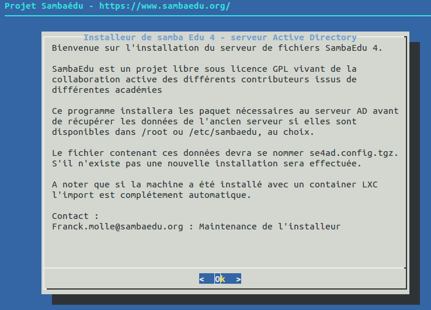
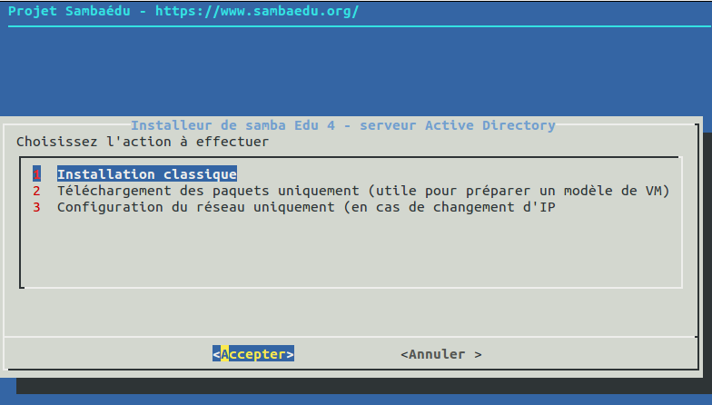
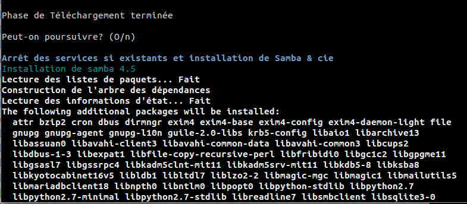
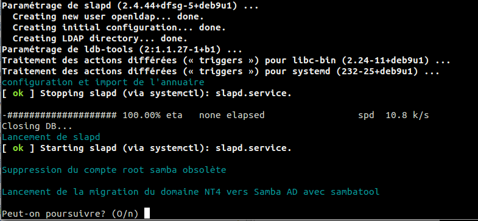
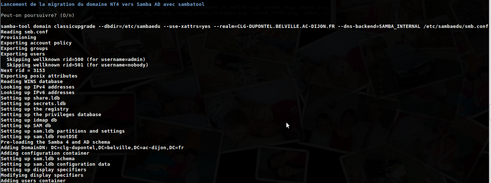
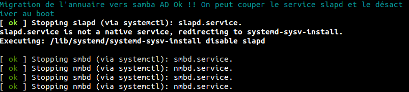
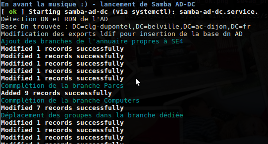

======================================================================
Installation et configuration de la machine ``SE4-AD`` sur ``Stretch``
======================================================================

.. sectnum::
.. contents:: Table des matières

Introduction
============

La machine ``SE4-AD`` sur ``Stretch`` pourra être soit une machine virtuelle ou bien un container ``LXC``, au choix. L'installation automatique décrite ici prend en compte les deux cas de figure.

* Machine virtuelle : À la suite de l'installation de ``Debian Stretch`` avec le fichier preseed, le script d'installation sera lancé lors de la première connexion en ``root`` afin de paramétrer ``Se4-AD``.

* Machine ``LXC`` : Elle est installée depuis le serveur de fichiers ``Se3`` qui se chargera d'y déposer tous les fichiers configuration.

**Avantages de la machine **``LXC`` **:** léger et facile à déployer, on peut monter une machine ``Debian Stretch`` tout en étant sur une machine ``Se3 Wheezy`` pour tester l'annuaire.
  
Dans un cas comme dans l'autre, tout sera automatique. On conserve une machine fonctionnelle durant toute la phase de migration et on s'assure de la compatibilité de l'annuaire.

Déroulement de l'installation
=============================

À l'installation de la machine virtuelle ou du container ``LXC``, le script d'installation a été poussé sur la machine (qu'elle soit virtuelle ou un container) dans le répertoire ``/root`` de cette machine.

Le script se lance immédiatement au login en ``root`` sur cette machine, à l'aide d'un fichier ``.profile`` qui a été modifié pour ce lancement automatique.

Accueil
-------

Après le message de bienvenue, La liste de choix s'affiche :

Quelques précisions sur chacune des options :

#. Installation classique : cas détaillé ici. Il s'agit d'effectuer l'installation et la configuration d'un ``se4-AD`` avec import des données de l'annuaire du serveur ``Se3`` d'origine vers l'``Active Directory``.

#. Téléchargement des paquets uniquement : utile pour des tests ou la réalisation d'un master de machine virtuelle. Tous les paquets utiles sont téléchargés dans le cache sans forcément être installés. Cela rend l'installation indépendante de toute configuration.

#. Configuration du réseau : le but est uniquement de modifier la configuration réseau de la machine. À noter que cette configuration doit être effectuée avant le déroulement d'une installation classique.

Installation des paquets prioritaires et téléchargement des paquets samba
-------------------------------------------------------------------------

L'installation débute par le téléchargement des paquets principaux et leur configuration. C'est par exemple le cas pour le serveur ``SSH``.

.. figure:: images/se4ad_primo_packages.png  

Concernant le serveur ``SSH``, il est à noter deux choses :

* Les clés publiques, si elles existent, sont automatiquement récupérées du serveur ``Se3`` si l'on a effectué l'installation d'un container ``LXC``
* La version 7 de ``SSH`` (donc sur ``Debian Stretch``) bannit l'utilisation des clés de type ``DSS``. Seules les clés ``RSA`` sont encore supportées. Par conséquent si vous utilisiez des clés ``DSS``, il faudra les refaire en ``RSA``.

Installation de Samba
---------------------

Après le téléchargement des paquets, le script attend votre confirmation avant de poursuivre :

Mise en place du serveur ``openldap`` local et import des anciennes données
---------------------------------------------------------------------------

Un serveur ``ldap`` est activé de façon temporaire afin de disposer des données de l'ancien serveur. Les différents éléments de configuration sont récupérés à partir du fichier ``sambaedu.config.tgz``. (d'où provient ce fichier ?)

L'archive ``ldif`` de sauvegarde de l'annuaire est ensuite incorporé avant de lancer le service.

Quelques opérations de nettoyage ou mise en conformité sont également effectuées afin de faciliter la migration vers ``AD``.

Migration des données ``openldap`` vers ``Samba AD`` avec ``sambatool``
-----------------------------------------------------------------------

Il s'agit de l'étape cruciale de toute l'opération. L'outil ``sambatool`` est utilisé en mode ``classicupgrade`` afin d'abonder l'``active Directory``.

Le script utilise les différents éléments de configuration issus de l'ancien serveur, à savoir :

* ``smb.conf`` dont certains paramètres ont été modifiés
* les données de l'annuaire ``LDAP``
* les anciens fichiers ``TDB``

**Note :** Toutes ces données sont récupérées depuis le répertoire ``/etc/sambaedu``.

La migration s'est déroulée sans erreur, le service ``LDAP`` est arrêté afin de libérer le port 389.

Lancement de ``Samba`` en mode ``AD`` et import des branches ``LDAP`` propres à ``SE3``
---------------------------------------------------------------------------------------

Le service ``samba AD-DC`` peut désormais être lancé :

Durant cette opération, tous les éléments de l'annuaire propres à ``SambaEdu`` n'ayant pas été pris en charge par ``sambatool`` sont créées ou positionnés dans les branches ad-hoc.

**Note :** Un système de temporisation  est ensuite mis en place afin d'attendre la disponibilité de l'annuaire ``AD`` car le tout premier lancement prend jusqu'à quelques minutes.

Choix du mot de passe de l'administrateur ``AD``
------------------------------------------------

Le compte qui gère l'``AD`` se nomme désormais ``Administrator``. Un mot de passe aléatoire a été initialisé lors de la migration, il convient donc de le modifier afin d'en choisir le contenu.

.. figure:: images/se4ad_pass_admin.png

**Attention :** le mot de passe du compte ``Administrator`` requiert un certain niveau de complexité :
  
  - 8 caractères minimum
  - Un mélange de lettres et de chiffres
  - Au moins un caractère spécial

La politique de mot de passe est ensuite assouplie pour les autres comptes.

Fin de L'installation
---------------------

L'installation se termine avec le changement du mot de passe du compte ``root``. Il va de soit qu'il devra être différent du compte ``Administrator`` qui gère l'``AD``.

