=================================================================================================
Génération des fichiers ``preseed`` et installation automatique d'un serveur ``SE4-AD`` et SE4-FS
=================================================================================================

.. sectnum::
.. contents:: Table des matières

Introduction
============

Ce document a pour but de décrire précisément la procédure d'installation automatique d'un serveur ``SE4 Active Directory`` ou ``SE4 File Server`` en utilisant un fichier ``preseed`` généré au préalable sur le serveur ``Se3`` contenant les données d'origine.

L’installation complète des deux serveurs se déroule selon l'ordre suivant :

* Lancement du script permettant de générer les fichiers ``preseed`` à partir des réponses fournies
* Installation automatique du serveur SE4-AD avec le fichier ``preseed`` depuis un boot ``PXE`` ou un support ``CD`` / clé ``USB``, puis après reboot, la finalisation de sa configuration avec réintégration des données ``LDAP`` issues du SE3 d'origine et peuplement de l'annuaire Active Directory ``AD``
* Installation automatique du serveur SE4-FS puis configuration de ce dernier selon des modalités similaires. A noter qu'il est indispensable d'avoir un Serveur Active Directory pleinement fonctionnel avant d'installer le se4-FS.

Cette documentation s’attardera plus précisément sur la génération des preseed ainsi que la première partie de l'installation du se4-AD (ce sera similaire pour SE4-FS). La finalisation étant détaillée dans une autre documentation_ car elle n'est pas propre au type d'installation évoqué ici (serveur autonome ou virtualisé), mais s'applique également aux containers ``LXC``.
 

.. _documentation: install-se4AD.rst

Déroulement du script générant les fichiers ``preseed``
=======================================================

À partir du moment où le paquet ``sambaedu-config`` est installé, le script se trouve dans le dossier ``/usr/share/se3/sbin``.

La commande à lancer est donc la suivante :

.. Code::

 /usr/share/se3/sbin/gen_se4preseed.sh

Accueil
-------

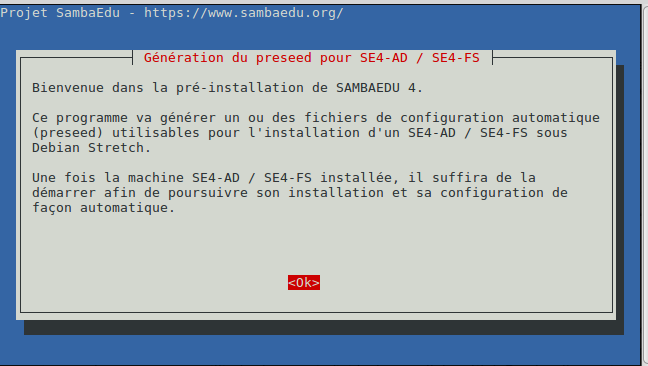

Après le message de bienvenue, un court résumé des paramètres réseau actuel détectés est affiché :

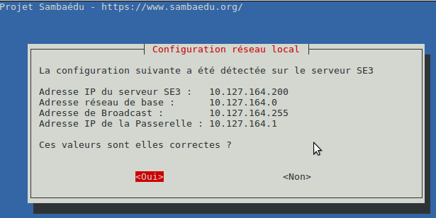

Ces valeurs serviront de base pour la configuration réseau du serveur ``AD``. Si elles ne sont pas correctes, il suffit de répondre ``non``. Dans ce cas il sera possible de préciser les bonnes valeurs une par une.

Paramétrage du futur ``SE4-AD``
-------------------------------

Viennent ensuite quelques questions sur la configuration du serveur SE4-AD.

Choix du disque pour l'installation
...................................

La première chose à indiquer est l'unité de disque sur laquelle l'installation sera effectuée. Sauf cas particulier, il suffit de confirmer le choix par défaut. 

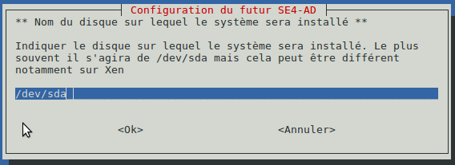

Choix d'une adresse ``IP`` et d'un nom
......................................

On commence par saisir l'``IP`` du serveur ``Se4-AD``. S'il est dans le même subnet que l'actuel serveur ``Se3``, il suffit de compléter le début de l'``IP`` suggérée.

**Attention :** Il faut bien saisir une adresse indépendante, donc pas la même ``IP`` que celle du ``Se3``.

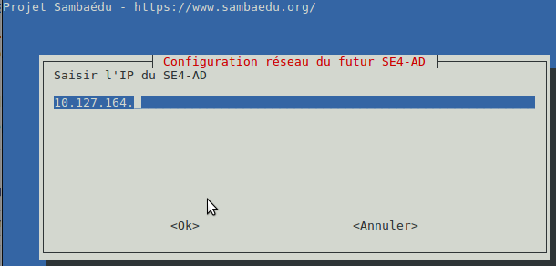

De même, on donne un nom au serveur ``AD``. Le choix par défaut semble correct :).

.. figure:: images/gen_preseed4.png

Choix du nom de domaine
.......................

**Attention :** un point tout particulier est à apporter au domaine ``AD``. En mode Active Directory il correspond au domaine ``DNS`` sur lequel le serveur ``AD`` sera serveur de nom. Par défaut le nom de domaine ``AD`` proposé sera le domaine ``DNS`` actuel du ``Se3``. Vous pouvez utiliser ce choix ou le modifier à votre convenance. Le fait que toutes les machines clientes seront sur cette même zone ``DNS`` distribuée par le serveur ``DHCP`` est également à prendre en compte. Il faut donc bien réfléchir à ce choix si l'on veut obtenir quelque chose de cohérent au final.

Ce nom de domaine devra être composé d'au moins deux parties séparées par un point. Dans notre exemple, il y en a quatre.
 
* La première partie correspond au domaine ``samba``. Appelé également ``workgroup``, cet élément **ne doit absolument pas dépasser 15 caractères**. À noter également qu'il n'est pas souhaitable de reprendre celui de ``Se3``, à savoir l'habituel "sambaedu3" afin d'éviter tout conflit.

* La ou les parties suivantes correspondent à ce que l'on nomme le suffixe ``DNS``

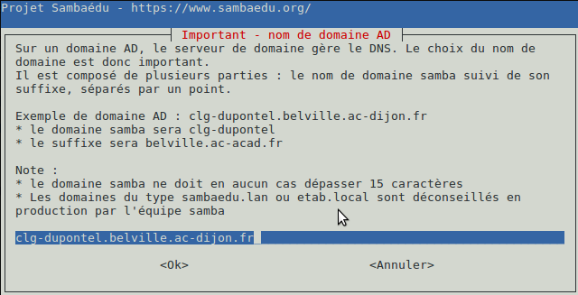

Résumé des paramètres
.....................

Un récapitulatif de l'ensemble des paramètres saisis précédemment est affiché :

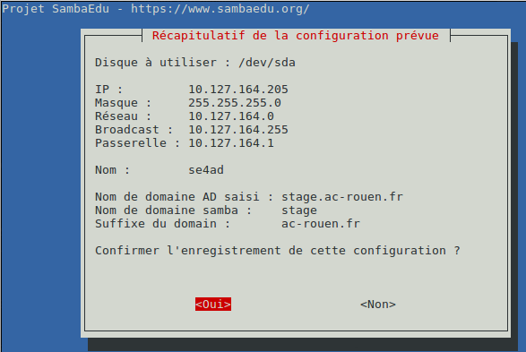

Si tout paraît correct, on peut confirmer. Dans le cas contraire, il sera proposé de corriger individuellement chaque paramètre.

Paramétrage du futur ``SE4-FS``
-------------------------------

Le script va désormais proposer la pré-configuration du serveur SE4-FS. Sauf cas particulier, on procédera également à la génération du ``preseed`` pour ce serveur.

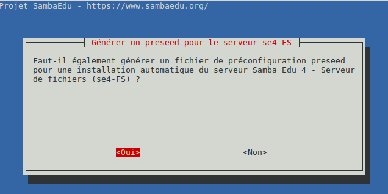

Choix d'une adresse ``IP`` et d'un nom
......................................

On commence par saisir l'``IP`` du serveur ``Se4-FS``. S'il est dans le même subnet que l'actuel serveur ``Se3``, il suffit de compléter le début de l'``IP`` suggérée.

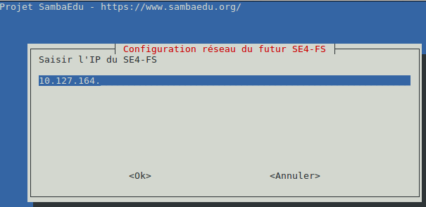

Puis on confirme son nom.

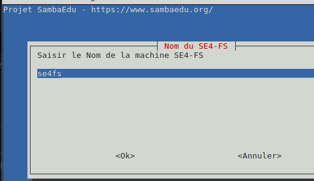

Un résumé des paramètres réseau est ensuite affiché.

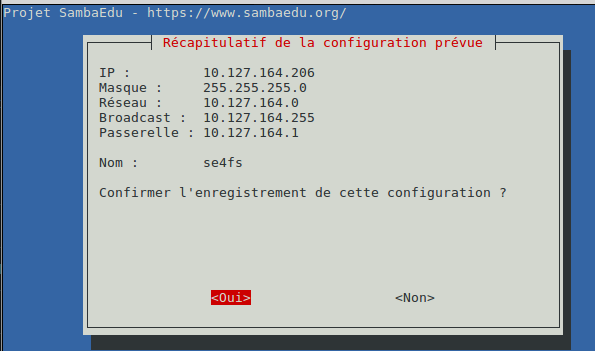

Choix du disque et taille des partitions
........................................

On commence par choisir le disque à utiliser pour l'installation

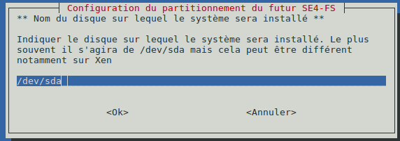

Vient ensuite le choix de la tailles de partitions. La seconde valeur appelée ``optimale`` est la plus importante car c'est celle que l'on désire obtenir. Le programme de partitionnement essaiera de fixer cette dernière prioritairement dans la mesure du possible.

On paramètre la partition racine. Les valeurs par défaut peuvent être appliquées

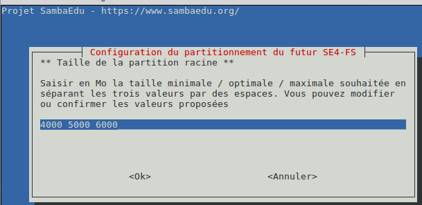

puis la partition /var. Les valeurs par défaut peuvent être appliquées

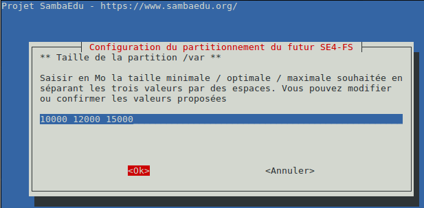

puis la partition /home. Les valeurs sont à adapter en fonction de la taille du disque.

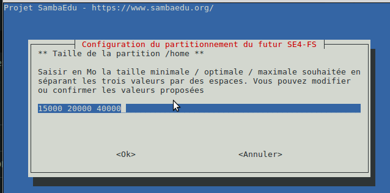

Et enfin la partition /var/sambaedu. Les valeurs sont à adapter 

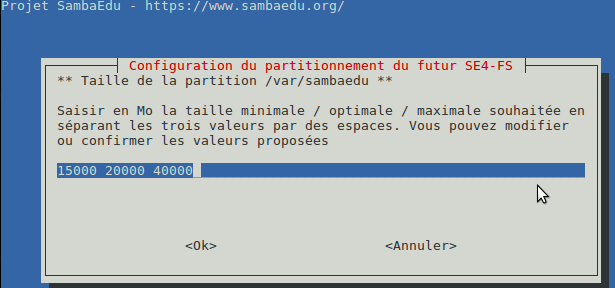

La configuration se termine par un résumé des paramètre saisies à l'exception de la partition swap qui n'est pas paramétrable.

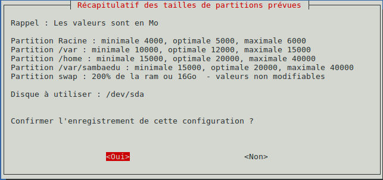

Export des données, génération des ``preseed`` et configuration du serveur ``PXE / TFTP``
-----------------------------------------------------------------------------------------

À partir des éléments saisis précédemment, le script va exécuter plusieurs tâches :

* Export des données importantes comme les données ldap, les fichiers tdb de samba ou les réservation DHCP
* Ecriture des fichiers ``preseed`` et fichiers de configuration nécessaires à l'installation dans le dossier ``/var/www/diconf`` les rendant ainsi disponibles sur le serveur web du ``Se3``. 
* Modification de la configuration du serveur ``TFTP`` du ``Se3`` afin que ce dernier puisse être utilisé pour installer ``SE4-AD`` et ``SE4-FS`` en mode ``PXE``.

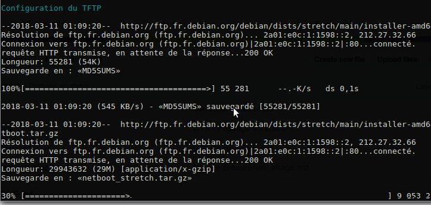

Tous les fichiers sont en place pour démarrer l'installation automatique de notre ``se4-AD`` comme de notre ``se4-FS`` . Un message de confirmation indique comment procéder.

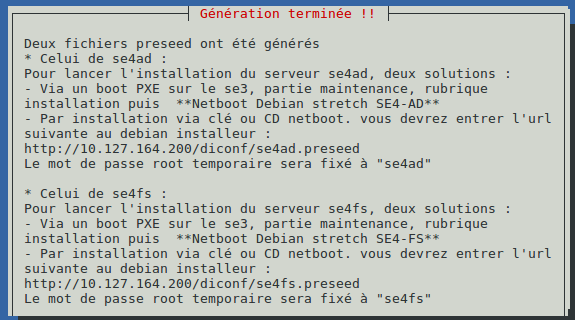

Vous pouvez donc effectuer l'installation de deux façons : 

* En utilisant le fichier ``preseed`` généré via le serveur ``TFTP`` du ``Se3`` en bootant en ``PXE`` et en choisissant l'option adéquate, détaillée plus loin dans ce document.
* En utilisant le fichier ``preseed`` généré et son propre support d'installation ``Debian Stretch`` sur ``CD`` ou clé ``USB``.

Installation du SE4-AD ou SE4-FS à partir des fichiers ``preseed``
==================================================================

Il s'agit maintenant d'utiliser les fichiers ``preseed`` généré précédemment. **Leur utilisation sera identique pour les deux serveurs mais il faudra commencer impérativement par SE4-AD**.

Chaque installation est documentée séparément et de façon détaillée. 

Ainsi  : 

* Pour le serveur ``SE4-AD``, `on pourra se reporter à cette documentation <install-se4AD-di.rst>`__

* Pour le serveur ``SE4-FS``, `on pourra se reporter à cette documentation <install-se4FS-di.rst>`__

