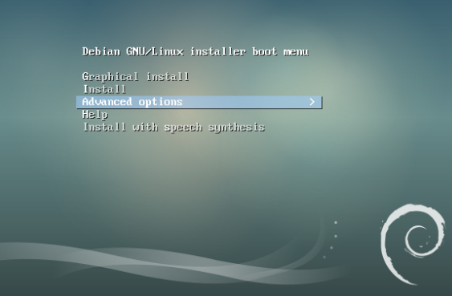
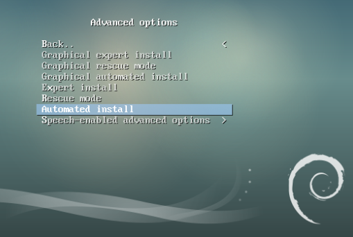
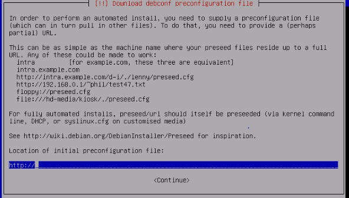
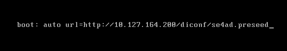
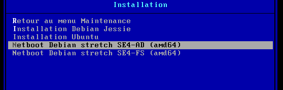
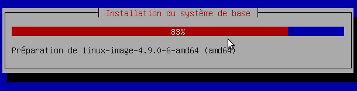
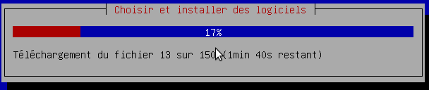
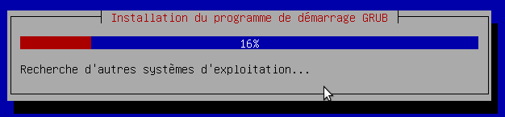
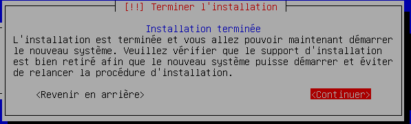

==================================================================================
Installation automatique d'un serveur ``SE4-FS`` phase 1 : partie Debian Installer
==================================================================================

.. sectnum::
.. contents:: Table des matières

Introduction
============

Ce document a pour but de décrire précisément la phase d'installation automatique d'un serveur ``SE4 Files server`` ou  ``SE4-FS`` en utilisant un fichier ``preseed``. 

`communication avec AD - API <documentation/developpement/API.md>`__

`Ce fichier aura été généré au préalable, soit sur le serveur <gen-preseed-se4AD.rst>`__
``Se3`` contenant les données d'origine en cas d'une migration ou bien depuis le serveur `Dimaker en cas de nouvelle installation.

L’installation automatique du serveur SE4-FS peut se faire selon les modalités suivantes :

* Depuis un boot ``PXE`` sur l'ancien serveur SE3 s'il s'agit d'une migration

* Avec un support ``CD`` ou / clé ``USB`` type netboot

Choix du support d'installation
===============================

Il faut commencer par démarrer l'installation du futur serveur ``Se4-FS``, soit par un boot ``PXE``, soit sur son support ``CD`` ou clé ``USB``. Seul ce boot initial va différer, la suite sera commune puisque l'on chargera le même fichier ``preseed``.

Depuis un ``CD`` ou une clé ``USB``
-----------------------------------

Lors de l'affichage du menu de boot, ne lancez pas une installation classique mais sélectionnez les options avancées comme indiqué sur cette capture.

Puis choisissez l'installation de type automatique

L'installation va alors débuter. Au bout de quelques minutes, vous serez inviter à saisir l'url du fichier de configuration ``preseed`` à utiliser. Attention, à ce stade le clavier est encore configuré en ``qwerty``.

Une fois l'url complétée, il faut bien prendre soin de vérifier l'absence d'erreur de saisie avant de valider.

Raccourci pour les connaisseurs
...............................

Il est également possible de donner l'url du preseed dés le départ en appuyant sur la touche ``Echap`` lors du premier écran de boot et de saisir la ligne suivante en adaptant l'``ip`` du ``Se3`` 
Attention, le clavier est configuré en ``qwerty`` au boot alors que vous utilisez sans doute un clavier ``azerty``.

En utilisant le boot ``PXE`` d'un SE3 existant (migration de serveur)
---------------------------------------------------------------------

Si vous optez pour cette solution, il suffit d'effectuer un boot ``PXE`` et de choisir l'entrée ``Maintenance`` 

.. figure:: images/se4_preseed_boot1.png

puis ``Installation`` et enfin ``Netboot Debian Stretch SE4-FS (amd64)``. 
.. Attention:: seule l'architecture ``amd64`` est supportée.

Déroulement de la suite de l'installation du SE4-FS
===================================================

Quelque soit la méthode employée (``PXE`` / ``CD`` / clé ``USB``), une fois le fichier ``preseed`` chargé, la suite est automatique. Vous trouverez, ci-dessous, quelques commentaires sur certaines étapes de cette installation.

Partitionnement
---------------

.. Attention:: **lors de cette étape toutes les données du disque sont effacées sans avertissement**

L'outil de partitionnement debian fera en sorte de s'adapter au mieux en fonction de la taille totale du disque et des partitions à créer sachant que la taille moyenne de chaque partition a été définie lors de la phase de génération du ``preseed``

Cinq partitions seront créées.

* Partition Racine ``/`` ext4
* Partition ``/var`` ext4
* Partition ``/home`` xfs
* Partition ``/var/sambaedu`` xfs
* Partition ``Swap`` 

Installation du système
-----------------------

Une fois les partitionnement effectué, commence l'installation du système de base.

La suite consiste à installer les logiciels complémentaires. Cela prend quelques minutes et fluctue selon le débit de votre connexion internet.

Configuration de ``Grub``
-------------------------

``Grub`` est installé afin de rendre le système bootable.

Fin de l'installation
--------------------- 

Vient enfin le message final, signalant que le serveur est prêt à rebooter.

À cette étape, vous disposez d'une ``Debian Stretch`` installée contenant tous les fichiers de configuration nécessaires à la suite de l'installlation de votre ``Se4-FS``.

Il vous reste à lancer cette machine, booter sur le nouveau système et vous y connecter en tant que ``root``.

Un programme afin d'en finaliser sa configuration automatique. Pour cela, on se reportera à la documentation_ détaillant les étapes nécessaires à l'obtention de votre ``SE4-FS`` pleinement fonctionnel.

.. _documentation: install-se4FS.rst

