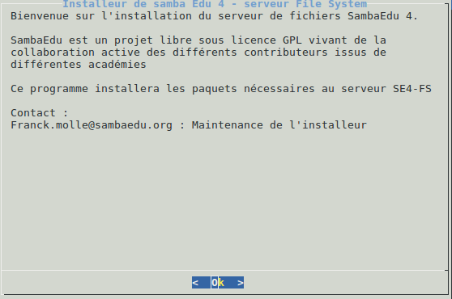
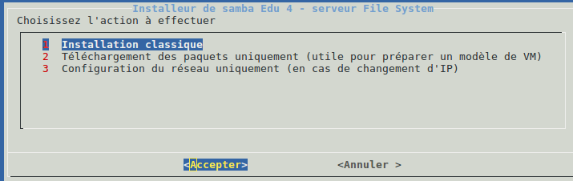
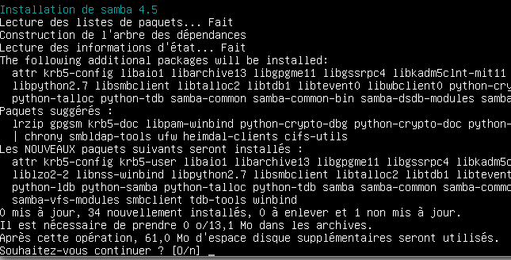
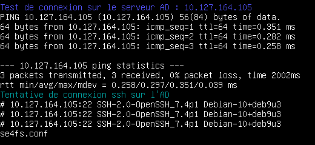
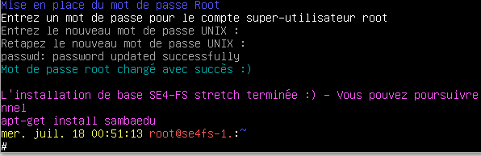

======================================================================
Installation et configuration de la machine ``SE4-FS`` sur ``Stretch``
======================================================================

.. sectnum::
.. contents:: Table des matières

Introduction
============

La machine ``SE4-FS`` sur ``Stretch`` pourra être soit une machine virtuelle ou physique, au choix. L'installation automatique décrite ici prend en compte les deux cas de figure.

Déroulement de l'installation
=============================

Lors de l'étape précédente de l'installation du SE4-FS, le script d'installation a été poussé sur la machine dans le répertoire ``/root``.

Le script se lance immédiatement au login en ``root`` sur cette machine, à l'aide d'un fichier ``.profile`` qui a été modifié pour ce lancement automatique.

Accueil
-------

Après le message de bienvenue, La liste de choix s'affiche :

Quelques précisions sur chacune des options :

#. Installation classique : cas détaillé ici. Il s'agit d'effectuer l'installation et la configuration d'un ``se4-FS`` en liaison avec un serveur d'annuaire AD déjà fonctionnel.

#. Téléchargement des paquets uniquement : utile pour des tests ou la réalisation d'un master de machine virtuelle. Tous les paquets utiles sont téléchargés dans le cache sans forcément être installés. Cela rend l'installation indépendante de toute configuration.

#. Configuration du réseau : le but est uniquement de modifier la configuration réseau de la machine. À noter que cette configuration doit être effectuée avant le déroulement d'une installation classique.

Installation des paquets prioritaires et téléchargement des paquets samba
-------------------------------------------------------------------------

L'installation débute par le téléchargement des paquets principaux et leur configuration. C'est par exemple le cas pour le serveur ``SSH``.

Installation de Samba
---------------------

Après le téléchargement des paquets, le script attend votre confirmation avant de poursuivre :

Les paquets samba et ses dépendances sont ensuite installés

Tests de connexion sur l'AD
--------------------------- 

Des connexions sont lancés sur l'AD. **Il est donc indispensable que ce dernier soit opérationnel à partir de cette étape de l'installation** Si tel n'était pas le cas, il est possible d'arrêter le script puis de régler le problème

Fin de L'installation
---------------------

L'installation se termine avec le changement du mot de passe du compte ``root``

Votre machine est prête pour installer les paquet sambaedu :)

